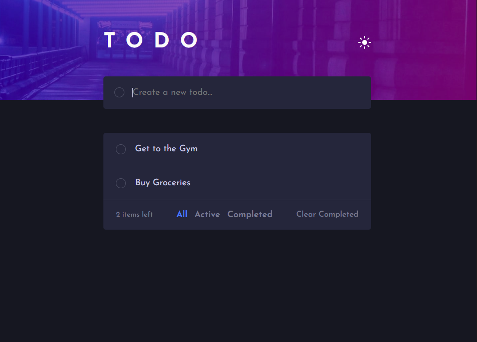
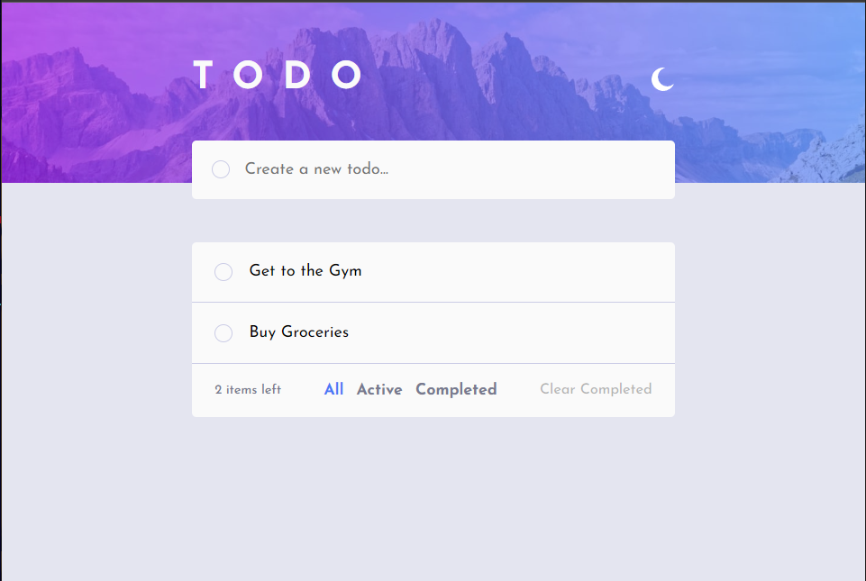

# Frontend Mentor - Todo app solution

This is a solution to the [Todo app challenge on Frontend Mentor](https://www.frontendmentor.io/challenges/todo-app-Su1_KokOW). Frontend Mentor challenges help you improve your coding skills by building realistic projects.

## Table of contents

-   [Overview](#overview)
    -   [The challenge](#the-challenge)
    -   [Screenshot](#screenshot)
    -   [Links](#links)
-   [My process](#my-process)
    -   [Built with](#built-with)
    -   [What I learned](#what-i-learned)
    -   [Continued development](#continued-development)
    -   [Useful resources](#useful-resources)
-   [Author](#author)

## Overview

### The challenge

Users should be able to:

-   View the optimal layout for the app depending on their device's screen size
-   See hover states for all interactive elements on the page
-   Add new todos to the list
-   Mark todos as complete
-   Delete todos from the list
-   Filter by all/active/complete todos
-   Clear all completed todos
-   Toggle light and dark mode
-   **Bonus**: Drag and drop to reorder items on the list

### Screenshot

### Links

-   Solution URL: [https://github.com/Aryan-ki-codepanti/todo-app-client-fm](https://github.com/Aryan-ki-codepanti/todo-app-client-fm)
-   Live Site URL: [Add live site URL here](https://your-live-site-url.com)

## My process

### Built with

-   Semantic HTML5 markup
-   CSS custom properties
-   Flexbox
-   [React](https://reactjs.org/) - JS library

### What I learned

-   Theme manager and styles
-   some advanced css tech

### Continued development

-   using drag and drop here

### Useful resources

-   GFG
-   React Docx

## Author

-   Website - [Aryan Sethi](https://github.com/Aryan-ki-codepanti)
-   Frontend Mentor - [@Aryan Sethi](https://www.frontendmentor.io/profile/Aryan-ki-codepanti)
